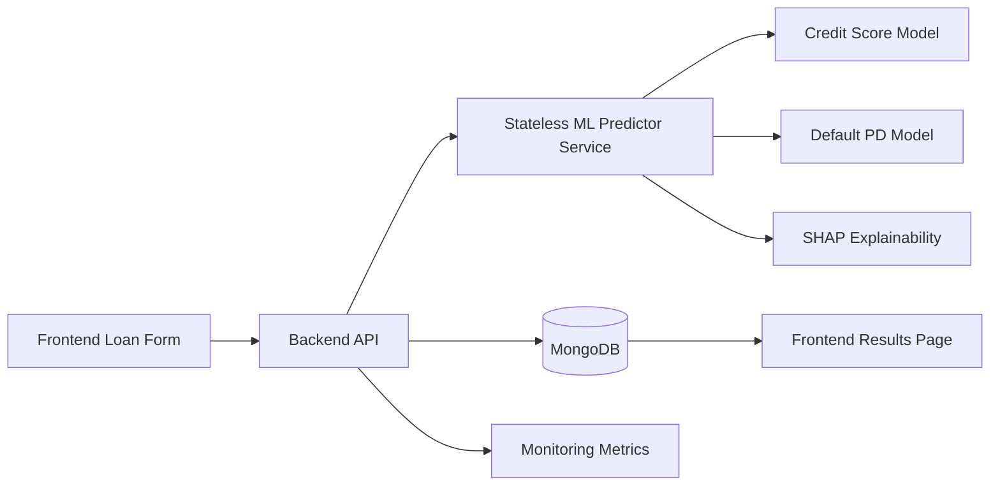

# CrediSure - Credit Risk Analyzer

A production-grade credit risk assessment system for loan default prediction, designed with practices used in reinsurance and financial risk teams.

## Business Problem

Lenders need consistent, explainable decisions for credit risk. This system predicts a normalized credit score and probability of default (PD), segments applicants into business-friendly risk buckets, and logs monitoring metrics to detect drift in production.

## System Architecture



## Modeling Approach

- **Two-stage pipeline**
  - Stage 1: Credit score model produces a normalized score (300–850).
  - Stage 2: Default PD model uses the credit score as an explicit feature.
- **Reusable preprocessing**
  - Missing value handling
  - Numerical scaling using versioned artifacts
  - Categorical encoding via stable mappings
- **Artifacts** live in `ml_artifacts/` and are versioned for repeatability.
 - **Stateless inference** loads models once at startup and reuses them for thread-safe scoring.

## Explainability Approach

- SHAP values are computed for the PD model.
- Top 5 drivers are stored with each prediction in MongoDB.
- API returns a concise explanation summary for UI display.

## Monitoring Strategy

- Every prediction logs probability and key feature values.
- Daily aggregates track feature distributions and PD stats.
- Simple drift detection uses z-score checks against a baseline distribution.
- Prediction logs retain preprocessing and model version metadata.

## API Output (Core Fields)

- `creditScore`
- `defaultProbability`
- `riskBucket` (Low / Medium / High)
- `explanationSummary`
- `credit_score`
- `probability_of_default`
- `risk_bucket`
- `explanation_summary`

## Request/Response Schema Notes

- Requests are validated against required loan fields before inference.
- Responses include both camelCase and snake_case keys for backward compatibility.
- Model and preprocessing versions are returned for traceability.

## Tech Stack

- **Frontend**: Next.js 15, React 19, TypeScript, Tailwind CSS
- **Backend**: Node.js, Express, MongoDB
- **ML Models**: LightGBM, PyTorch, SHAP
- **Database**: MongoDB

## Quick Start

### Prerequisites

- Node.js 18+
- Python 3.7+
- MongoDB (Atlas or local)

### Installation

1. **Backend Setup**
   ```bash
   cd Backend
   npm install
   pip install -r requirements.txt
   ```

2. **Frontend Setup**
   ```bash
   cd my-app
   npm install
   ```

3. **Environment Variables**

   Create `Backend/.env`:
   ```env
   MONGO_URI=your-mongodb-connection-string
   JWT_SECRET=your-jwt-secret-key
   PORT=5000
   ```

   Create `my-app/.env.local`:
   ```env
   NEXT_PUBLIC_API_URL=http://localhost:5000
   ```

4. **Run**

   Backend:
   ```bash
   cd Backend
   npm run dev
   ```

   Frontend:
   ```bash
   cd my-app
   npm run dev
   ```

## Project Structure

```
CreditSure/
├── Backend/          # Express API server
├── my-app/           # Next.js frontend
├── ml_artifacts/     # Versioned preprocessing artifacts
├── *.pkl            # ML model files
└── *.ipynb          # Model training notebooks
```

## Future Improvements

- Retrain models with a unified preprocessing pipeline artifact.
- Add batch monitoring dashboards and alerting.
- Introduce fairness and bias checks on protected attributes.
- Add calibration and rejection-inference strategies.

## License

MIT
