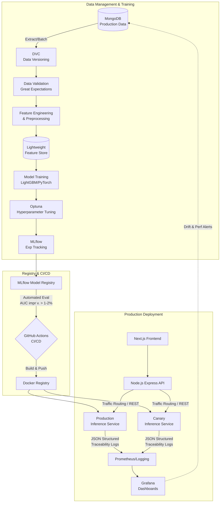

# CrediSure - Credit Risk Analyzer

A production-grade credit risk assessment system for loan default prediction, designed with practices used in reinsurance and financial risk teams.

## Business Problem

Lenders need consistent, explainable decisions for credit risk. This system predicts a normalized credit score and probability of default (PD), segments applicants into business-friendly risk buckets, and logs monitoring metrics to detect drift in production.

## System Architecture



## Modeling Approach

- **Two-stage pipeline**
  - Stage 1: Credit score model produces a normalized score (300–850).
  - Stage 2: Default PD model uses the credit score as an explicit feature.
- **Reusable preprocessing**
  - Missing value handling
  - Numerical scaling using versioned artifacts
  - Categorical encoding via stable mappings
- **Artifacts** live in `ml_artifacts/` and are versioned for repeatability.
 - **Stateless inference** loads models once at startup and reuses them for thread-safe scoring.

## Explainability Approach

- SHAP values are computed for the PD model.
- Top 5 drivers are stored with each prediction in MongoDB.
- API returns a concise explanation summary for UI display.

## MLOps Features

This system utilizes a fully automated MLOps pipeline ensuring reproducibility and consistency:
- **DVC (Data Version Control)**: Orchestrates data extraction, validation, and preprocessing pipelines, preventing Git bloat while enabling total reproducibility.
- **Great Expectations**: Data validation layer enforcing schema, range, and type consistency before training.
- **Lightweight Feature Store**: Parquet-based store centralizing feature definitions for training and online serving.
- **MLflow & Optuna**: Automated bayesian hyperparameter tuning and model experiment tracking. Uses the MLflow Registry for managing staging and production models.

## Monitoring Strategy

- **Structured Traceability**: Every prediction logs `input_features`, `model_version`, and `output_prediction` in JSON format.
- **Comprehensive Drift Detection**: 
  - *Input Drift*: Tracked via Population Stability Index (PSI).
  - *Prediction Drift*: Output distribution monitoring.
  - *Performance Drift*: Continuous calculation of decay using delayed labels.
- **Grafana & Prometheus**: Real-time alerting when thresholds are breached.

## Safe Deployment (Canary Releases)

- **CI/CD via GitHub Actions**: Linting, testing, and Docker container builds on merge.
- **Automated Promotion**: Models promote from staging only if AUC improves by ≥ 1.5% without business logic degradation.
- **Canary Routing**: Model is safely deployed to 5-10% of traffic. Upon stable inference, traffic seamlessly shifts to 100%.

## API Output (Core Fields)

- `creditScore`
- `defaultProbability`
- `riskBucket` (Low / Medium / High)
- `explanationSummary`
- `credit_score`
- `probability_of_default`
- `risk_bucket`
- `explanation_summary`

## Request/Response Schema Notes

- Requests are validated against required loan fields before inference.
- Responses include both camelCase and snake_case keys for backward compatibility.
- Model and preprocessing versions are returned for traceability.

## Tech Stack

- **Frontend**: Next.js 15, React 19, TypeScript, Tailwind CSS
- **Backend API**: Node.js, Express, MongoDB
- **Inference Service**: Python, FastAPI, MLflow Pyfunc
- **MLOps Platform**: DVC, Great Expectations, MLflow, Optuna
- **Monitoring**: Prometheus, Grafana

## Quick Start

### Prerequisites

- Node.js 18+
- Python 3.9+
- MongoDB (Atlas or local)
- Docker & Docker Compose (for MLOps & Monitoring Services)

### Installation

1. **Spin up MLOps Services & Inference**
   ```bash
   # (Assuming docker-compose orchestrates mlflow, prometheus, grafana, and inference)
   docker compose up -d
   ```

2. **Backend Setup**
   ```bash
   cd Backend
   npm install
   npm run dev
   ```

3. **Frontend Setup**
   ```bash
   cd my-app
   npm install
   npm run dev
   ```

4. **Environment Variables**

   Create `Backend/.env`:
   ```env
   MONGO_URI=your-mongodb-connection-string
   JWT_SECRET=your-jwt-secret-key
   PORT=5000
   INFERENCE_API_URL=http://localhost:8000
   ```

   Create `my-app/.env.local`:
   ```env
   NEXT_PUBLIC_API_URL=http://localhost:5000
   ```

5. **Run Training Pipeline (Optional)**
   ```bash
   cd ml_pipeline
   dvc repro
   ```

## Project Structure

```text
CreditSure/
├── Backend/                     # Node.js/Express API server
├── my-app/                      # Next.js frontend
├── ml_pipeline/                 # MLOps Pipeline Hub (DVC, Optuna, Training)
│   ├── data/                    # Version-controlled data & Feature Store
│   ├── src/                     # Python training & validation modules
│   └── dvc.yaml                 # DVC pipeline stages
├── ml_service/                  # Python FastAPI Inference Microservice
│   ├── app.py                   # MLflow pyfunc model serving
│   └── Dockerfile               
├── monitoring/                  # Prometheus configs and Grafana Dashboards
└── .github/workflows/           # CI/CD pipelines (mlops.yml)
```

## Future Improvements

- Introduce fairness and bias checks on protected attributes.
- Add calibration and rejection-inference strategies.
- Expand Great Expectations coverage across upstream database tables.

## License

MIT
